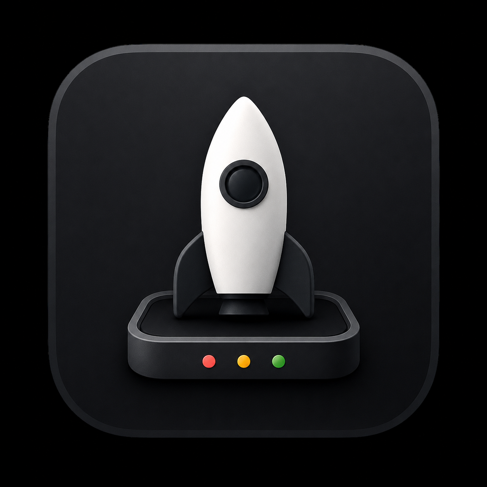
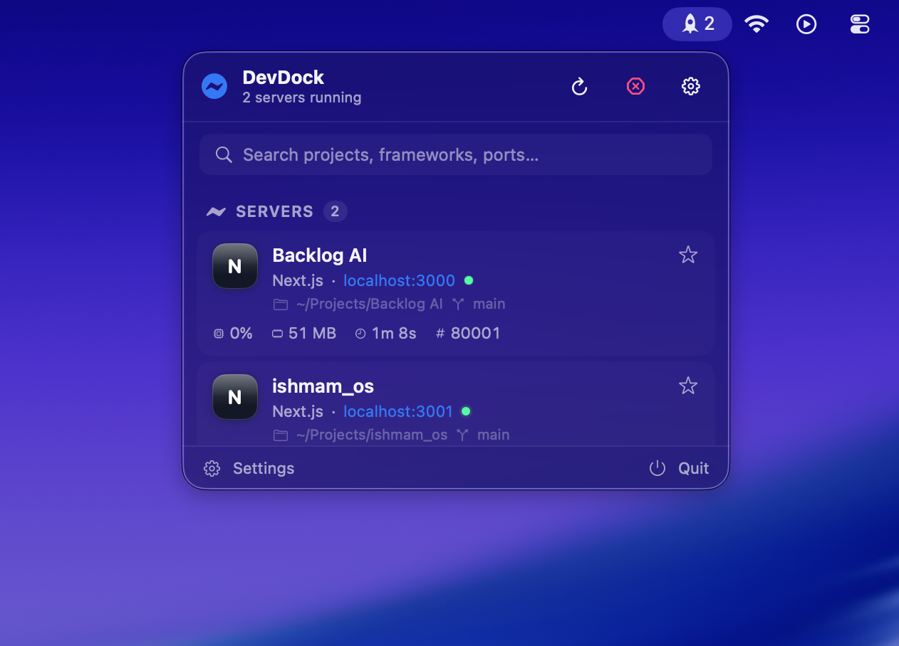
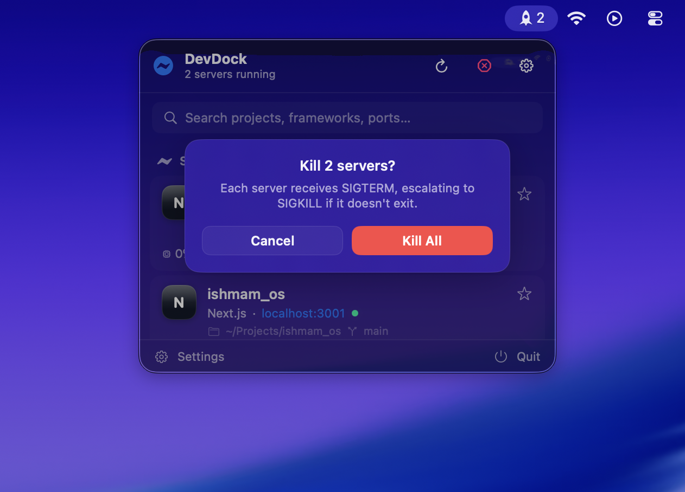
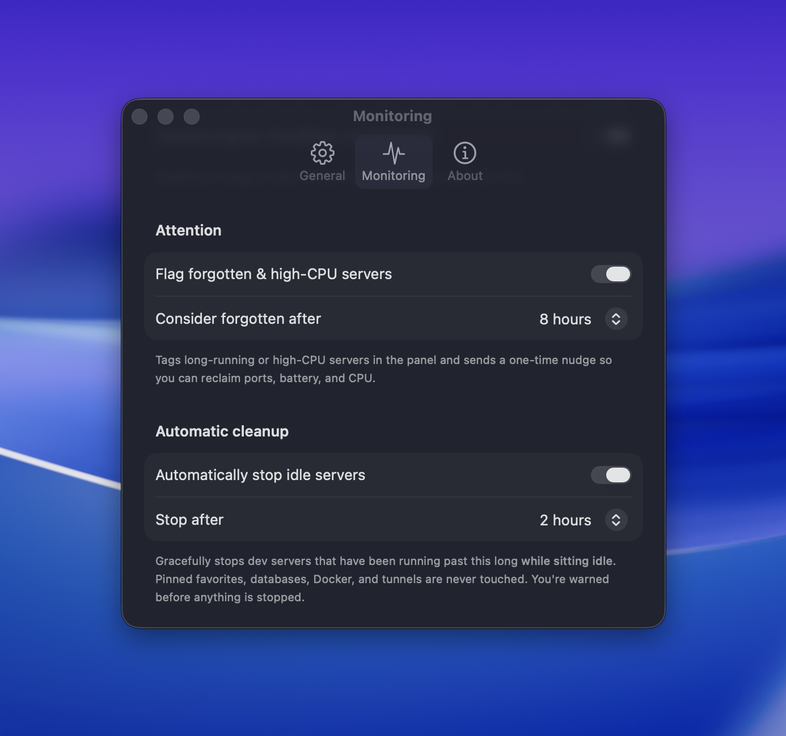
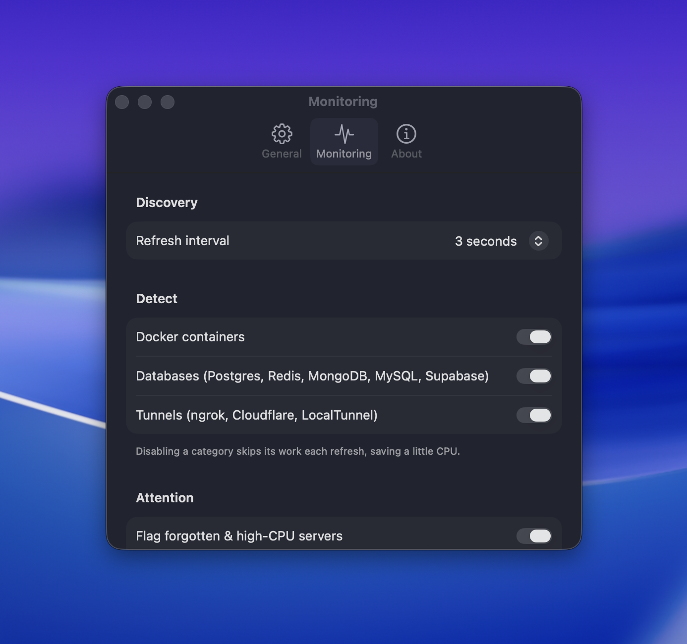
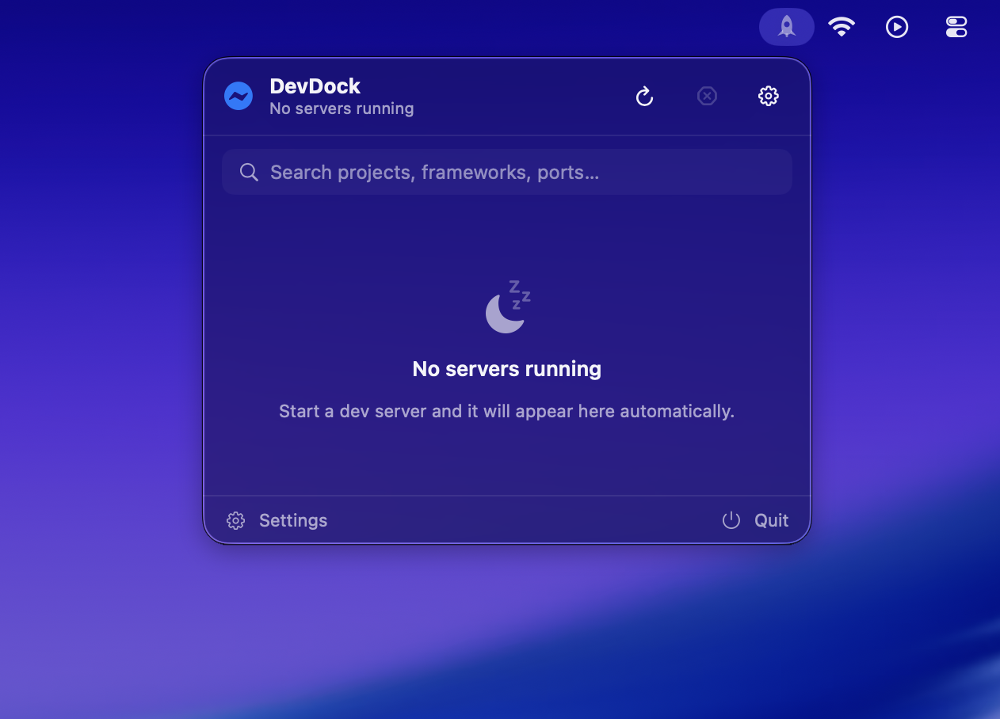

<p align="center">
  
</p>

<h1 align="center">DevDock 🚀</h1>

<p align="center">
  <a href="https://github.com/ishm6m/DevDock/actions/workflows/ci.yml"></a>
  <a href="https://github.com/ishm6m/DevDock/releases/latest"></a>
  <a href="LICENSE"></a>
  
</p>

**A developer control center that lives in your macOS menu bar.**

DevDock continuously discovers the development servers running on your machine —
Next.js, Vite, Django, Rails, Go, Docker containers, databases, tunnels, and more —
and gives you one‑click **Open / Reveal / Copy URL / Kill / Restart** for each,
without ever opening a terminal.

If you use AI coding tools (Claude Code, Cursor, Windsurf, Copilot…) you probably
start a lot of dev servers and forget to stop them. Forgotten servers hold ports,
drain the battery, and burn CPU. DevDock makes everything that's listening visible
and controllable from one place.

> Built with **Swift + SwiftUI only** — no Electron, no React, no web views. Native
> `MenuBarExtra`, Combine, Swift Concurrency, and `libproc`.

- **Platform:** macOS 14 (Sonoma) and later
- **License:** MIT (open source)
- **Distribution:** Direct download from [Releases](../../releases/latest). Currently
  **ad-hoc signed / not yet notarized**, so first launch needs one Gatekeeper step (below).
  *Not* sandboxed — see [Why it isn't sandboxed](#why-devdock-isnt-sandboxed). Maintainers who
  want a warning-free build can notarize it — see [Distribution (notarization)](#distribution-notarization).

---

## 📸 Screenshots

<p align="center">
  
  <br />
  <em>Every listening dev server, live — framework, <code>localhost:port</code>, CPU, memory, uptime, PID, project folder, and git branch.</em>
</p>

<p align="center">
  
  <br />
  <em>One-click Kill / Kill All, with a confirmation step.</em>
</p>

<p align="center">
  
  <br />
  <em>Flag forgotten servers and auto-stop idle ones.</em>
</p>

<p align="center">
  
  <br />
  <em>Detect Docker, databases, and tunnels too.</em>
</p>

<p align="center">
  
  <br />
  <em>Zero-config: start a server and it just appears.</em>
</p>

---

## ⬇️ Download & install

1. Download the latest **`DevDock-x.y.z.dmg`** from the
   **[Releases page](../../releases/latest)**.
2. Open the DMG and drag **DevDock** into your **Applications** folder.
3. **First launch only** — because the build isn't notarized yet, macOS Gatekeeper will
   hesitate. Do one of:
   - **Right-click** (or Control-click) **DevDock → Open → Open**, or
   - run once in Terminal:
     ```bash
     xattr -dr com.apple.quarantine /Applications/DevDock.app
     ```

After that it launches normally. Look for the **rocket icon** in your menu bar with a live
server count. DevDock keeps itself up to date via Sparkle once the maintainer configures
release signing; until then, grab new versions from Releases.

> Prefer to build it yourself? See [Getting started](#getting-started).

---

## Features

- **Live discovery** of every listening dev server, refreshed on an interval (default 3s).
- **Rich per‑server info:** framework, `localhost:port`, PID, running duration, CPU %,
  memory, thread count, project folder, git repo & branch.
- **Framework detection** for Next.js, Vite, React, Angular, Vue, Astro, Remix, Nuxt,
  Express, NestJS, Node, Flask, FastAPI, Django, Rails, Go, Rust, Bun, Deno, Expo,
  React Native Metro, Laravel, and PHP's built‑in server.
- **Actions:** Open in browser · Reveal project in Finder · Copy URL · Kill
  (graceful SIGTERM → SIGKILL) · Restart (relaunch original command) · **Kill All**
  (with confirmation). Every action gives inline feedback and can't be double-fired.
- **Live status** with a pulsing indicator, and a floating toast confirming each
  kill / restart result.
- **Search** by project name, framework, or port. **Favorites** pin projects to the top.
- **Live logs** for servers DevDock (re)starts — searchable, auto‑scrolling.
- **Notifications** for server started / stopped / port conflict.
- **Auto‑stop idle servers** (opt‑in): gracefully stops dev servers left running past a
  threshold (1–24h) *while sitting idle*. Warns first, exempts pinned favorites, and never
  touches databases, Docker, or tunnels.
- **Port‑conflict** highlighting when two processes fight over a port.
- **Docker** containers (open / stop / restart), **databases** (Postgres, Redis,
  MongoDB, MySQL, Supabase local), and **tunnels** (ngrok, Cloudflare, LocalTunnel).
- **Preferences:** launch at login, refresh interval, notifications, confirm‑before‑kill,
  and appearance (System / Light / Dark).
- **Automatic updates** via [Sparkle](https://sparkle-project.org) — signature‑verified,
  with a manual "Check for Updates…" and an auto‑check toggle in Preferences. Since
  DevDock ships outside the App Store, this is how a download stays current.

---

## Getting started

### Requirements

- macOS 14+
- Xcode 16+ (developed against Xcode 26 / Swift 6 toolchain in Swift 5 language mode)
- [XcodeGen](https://github.com/yonsson/XcodeGen): `brew install xcodegen`

### Build & run

```bash
# 1. Generate the Xcode project from project.yml
xcodegen generate

# 2. Open and run (⌘R), or build/test from the command line:
xcodebuild -project DevDock.xcodeproj -scheme DevDock -destination 'platform=macOS' build
xcodebuild -project DevDock.xcodeproj -scheme DevDock -destination 'platform=macOS' test
```

`DevDock.xcodeproj` is **generated** and git‑ignored — always run `xcodegen generate`
after pulling. Edit `project.yml` to change build settings.

> The **first** build resolves the [Sparkle](https://github.com/sparkle-project/Sparkle)
> Swift package over the network (`from: 2.9.0`, pinned in `project.yml`). After that it's
> cached. Building from source needs no update keys — auto‑update stays dormant until a
> maintainer configures the release credentials below.

When it launches you'll see a rocket icon with a live server count in the menu bar.
Click it for the panel.

---

## Architecture

DevDock is **MVVM with explicit dependency injection** — every service is a protocol,
constructed once in [`AppEnvironment`](DevDock/App/AppEnvironment.swift) and passed
down. There are no service singletons.

```
DevDock/
├── App/            App entry point, DI container, app delegate
├── Models/         Value types: DevServer, Framework, Port, ProjectInfo, GitInfo, …
├── Monitoring/     The discovery pipeline (PortScanner, ProcessMonitor, engine, coordinator)
├── Services/       FrameworkDetector, ProjectLocator, GitService, CommandRunner,
│                   NotificationManager, DockerService, DatabaseDetector, TunnelDetector, LogService
├── Commands/       ServerCommands (open/reveal/copy/kill/restart), KillStrategy
├── Persistence/    PreferencesStore, FavoritesStore (UserDefaults)
├── ViewModels/     MenuBarViewModel, LogViewModel
├── Views/          SwiftUI: MenuBar panel, Preferences, Logs, shared Components
├── Utilities/      Proc (libproc/sysctl), Formatters, Color+Hex, Debouncer, Log
└── Resources/      Info.plist, entitlements, asset catalog
```

### The discovery pipeline

The core design goal is to gather rich metadata **without spawning a shell per
process**. Each refresh:

1. **[`PortScanner`](DevDock/Monitoring/PortScanner.swift)** runs **one** `lsof` call
   (`lsof -nP +c 0 -iTCP -sTCP:LISTEN -Fpcn`) and parses its machine‑readable *field*
   output into `(pid, command, port, address)` records. Parsing field output (not
   columnar text) is what keeps it robust — and unit‑tested.
2. **[`ProcessMonitor`](DevDock/Monitoring/ProcessMonitor.swift)** enriches each PID via
   **`libproc`** syscalls (see [`Proc`](DevDock/Utilities/Proc.swift)): executable path,
   resident memory, thread count, cumulative CPU time, start time, and the working
   directory — plus the full, untruncated argv from `KERN_PROCARGS2`. CPU % is derived
   from the change in CPU time between refreshes.
3. **[`ProjectLocator`](DevDock/Services/ProjectLocator.swift)** walks up from the
   working directory looking for `package.json`, `Cargo.toml`, `go.mod`,
   `pyproject.toml`, `composer.json`, `Gemfile`, or `.git`.
4. **[`FrameworkDetector`](DevDock/Services/FrameworkDetector.swift)** classifies the
   framework from argv + `package.json` dependencies + Python manifests + project
   markers. The classifier is a pure function (`FrameworkClassifier`), so it's fully
   unit‑tested.
5. **[`GitService`](DevDock/Services/GitService.swift)** reads the branch from
   `.git/HEAD` and the repo name from `.git/config` **directly** — no `git` binary needed.
6. **[`DiscoveryEngine`](DevDock/Monitoring/DiscoveryEngine.swift)** (an `actor`) ties
   these together off the main thread, caches static per‑PID metadata (so only resource
   usage is recomputed each cycle), filters out system/editor noise, and detects port
   conflicts. It returns an immutable `DiscoverySnapshot`.
7. **[`DiscoveryCoordinator`](DevDock/Monitoring/DiscoveryCoordinator.swift)**
   (`@MainActor`) drives the timer loop, diffs snapshots to fire notifications, and
   publishes the `@Published` collections the UI observes.

### Services at a glance

| Service | Responsibility |
| --- | --- |
| `CommandRunner` | Async `Process` wrapper; resolves executables across common bin paths. |
| `PortScanner` | Single `lsof` call per refresh → parsed listening‑port records. |
| `ProcessMonitor` | Per‑PID resource metrics from `libproc`; caches CPU samples. |
| `FrameworkDetector` | Pure, layered framework classification. |
| `ProjectLocator` | Upward marker search for the project root. |
| `GitService` | Branch + repo name read straight from `.git`. |
| `NotificationManager` | `UNUserNotificationCenter` lifecycle alerts. |
| `DockerService` | `docker ps` parsing + stop/restart. Hidden when Docker is absent. |
| `DatabaseDetector` | Recognizes DBs from the port scan (port + process name). |
| `TunnelDetector` | ngrok local API + process detection for cloudflared/localtunnel. |
| `LogService` | Captures stdout/stderr for processes DevDock launches. |
| `ServerCommands` | Open / Reveal / Copy / Kill / Restart / Kill‑All. |
| `KillStrategy` | SIGTERM, grace period, then SIGKILL. Handles EPERM/ESRCH. |
| `AutoStop` / `AutoStopController` | Opt‑in auto‑stop of idle servers: a pure policy (`AutoStop`) plus the orchestrator that warns, waits out a grace window, and stops via `ServerCommands.kill`. |
| `UpdateChecking` / `SparkleUpdater` | Sparkle‑backed auto‑update behind a protocol; dormant until release credentials are configured. |

### Performance

- One `lsof` per cycle; all other per‑process data comes from cheap `libproc` syscalls.
- Static metadata (project, git, framework, argv) is computed **once per PID** and cached.
- All discovery runs off the main thread inside an `actor`; the UI only ever sees
  finished, immutable snapshots.
- Search input is filtered on already‑fetched data; sections are lazily rendered.

---

## Notes & honest constraints

### Why DevDock isn't sandboxed

DevDock's whole job is to inspect and control **other** processes: enumerate listening
ports (`lsof`), read their metadata (`libproc`), and signal them (`kill`). The App
Sandbox required by the Mac App Store forbids all of that. So DevDock ships **outside**
the App Store, signed with a Developer ID and notarized. It only ever acts on processes
**you own** — it never elevates privileges.

### Live logs are capture‑on‑restart

macOS cannot attach to the stdout/stderr of a process it didn't spawn. DevDock therefore
provides live logs **only for servers it starts or restarts** (it owns the pipes).
Externally‑started servers show a clear "Restart via DevDock to capture logs" state —
no fake logs.

### Restart is best‑effort for environment

Restart relaunches the exact original command in the original working directory. But a
process's **environment variables** can't be recovered after the fact, so a restarted
server inherits DevDock's environment. Restart is disabled when the command or directory
can't be determined.

### Kill safety

DevDock only ever signals a **specific, real, other** process. `kill(2)` interprets
non‑positive PIDs specially — `kill(0, …)` signals the caller's whole process group and
`kill(-1, …)` broadcasts — so a stale `pid == 0` could otherwise take DevDock (and its
children) down. Every termination path routes through a single guard
(`Proc.isSafeToSignal`) that refuses any PID that is `≤ 1` or is DevDock's own process,
*before* any `kill()` call, including the liveness probe. This invariant is covered by
unit tests (`KillSafetyTests`). Kill/restart are also serialized per‑server, so a
double‑click can never double‑signal a PID or spawn a duplicate process.

### Auto‑stop is conservative by design

Auto‑stopping a server is the one place DevDock acts without a click, so it is deliberately
cautious — enable it in **Preferences → Monitoring → Automatic cleanup**:

- **Off by default, opt‑in.**
- **Idle *and* old.** A server is only eligible once it has been up past the threshold **and**
  is near‑idle (CPU below `ServerAttention.idleCPUPercent`). A server actively serving or
  building is never reaped — it reuses the same "forgotten = old and idle" rule as the
  attention flag ([`AutoStop`](DevDock/Services/AutoStop.swift)).
- **Warned first.** When a server first qualifies you get a "Server Still Idle" notification;
  it is only stopped after a short grace window if it's *still* an idle candidate. A CPU spike
  during the window cancels the pending stop, and it is re‑warned before any later stop — a
  server is never stopped in a session without a warning in that session.
- **Favorites, databases, Docker, and tunnels are never touched.**
- **Graceful & safe.** It stops through the same `ServerCommands.kill` → `KillStrategy` path as
  a manual kill, so it inherits the SIGTERM→SIGKILL escalation and the `Proc.isSafeToSignal`
  guard. The pure policy is covered by `AutoStopTests`.

With notifications turned off, auto‑stop still works but stops silently (no warning is
delivered); Preferences flags this.

---

## Distribution (notarization)

To distribute a build to other Macs, sign with a Developer ID and notarize:

```bash
# Archive a Release build
xcodebuild -project DevDock.xcodeproj -scheme DevDock \
  -configuration Release -destination 'platform=macOS' \
  -archivePath build/DevDock.xcarchive archive

# Export with Developer ID signing, then notarize the .app/.dmg:
xcrun notarytool submit DevDock.dmg --keychain-profile "AC_NOTARY" --wait
xcrun stapler staple DevDock.dmg
```

Running locally from Xcode needs no paid account — automatic signing works for
development.

### Automatic updates (Sparkle)

DevDock uses [Sparkle](https://sparkle-project.org) so a downloaded build can update
itself — there's no App Store to do it. The code is wired and linked; it stays **dormant
until you supply release credentials**, so builds from source never nag or misbehave.
`SparkleUpdater` detects the source‑tree placeholders in `Info.plist` and disables update
checks until both of these are real.

**One‑time setup**

1. Generate an EdDSA key pair (private key is stored in your login keychain):

   ```bash
   # Sparkle's tools ship inside the resolved package, e.g.:
   ./DerivedData/*/SourcePackages/artifacts/sparkle/Sparkle/bin/generate_keys
   ```

   It prints the **public** key. Put it in `Info.plist` as `SUPublicEDKey` (public — it
   belongs in source control; the private key never does).
2. Set `SUFeedURL` in `Info.plist` to the HTTPS URL where you'll host `appcast.xml`
   (GitHub Pages / Releases both work).

**Each release**

1. Bump `MARKETING_VERSION` **and** `CURRENT_PROJECT_VERSION` in `project.yml`
   (Sparkle compares the build number), then `xcodegen generate`.
2. Archive → export with Developer ID → notarize + staple the `.dmg` (above).
3. Sign the update and generate the appcast entry:

   ```bash
   ./DerivedData/*/SourcePackages/artifacts/sparkle/Sparkle/bin/sign_update DevDock.dmg
   # Feeds the EdDSA signature into the appcast <item>. `generate_appcast` can build
   # the whole appcast.xml from a folder of signed DMGs:
   ./DerivedData/*/SourcePackages/artifacts/sparkle/Sparkle/bin/generate_appcast /path/to/releases/
   ```

4. Upload the `.dmg` and the updated `appcast.xml` to the host behind `SUFeedURL`.

Existing installs pick it up on their next background check (or via **Preferences →
General → Check for Updates…**). Sparkle verifies the EdDSA signature against
`SUPublicEDKey` before installing, so a tampered download is rejected.

---

## Contributing

DevDock is open source under the MIT License and contributions are welcome.

1. `brew install xcodegen`
2. `xcodegen generate`
3. Make your change; add tests where it makes sense.
4. `xcodebuild -project DevDock.xcodeproj -scheme DevDock -destination 'platform=macOS' test`
5. Open a PR.

Good first areas: additional framework signatures in `FrameworkClassifier`, real logo
assets to replace the monogram badges, and richer tunnel URL resolution.

---

## License

[MIT](LICENSE) © DevDock contributors.
